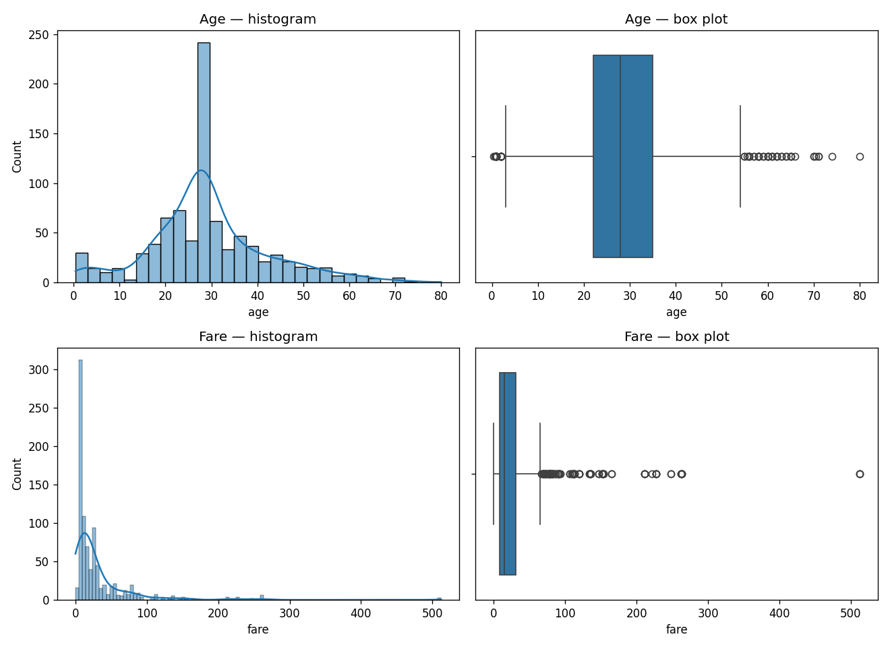
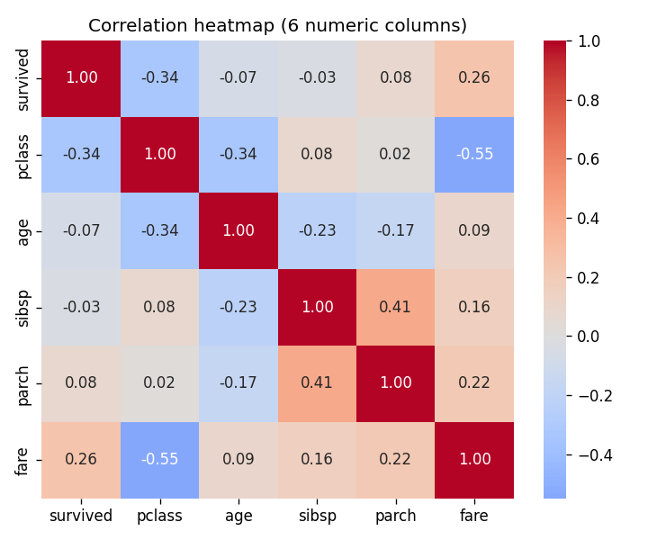
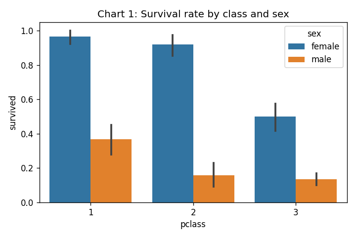
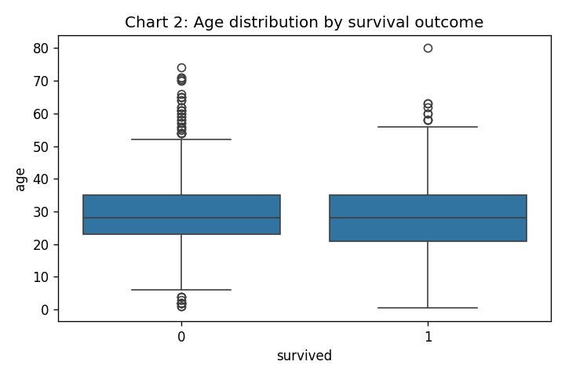
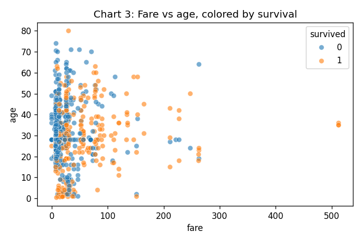
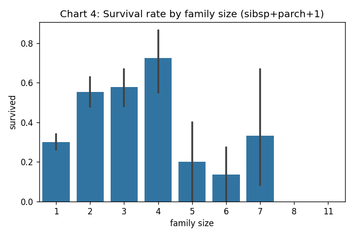
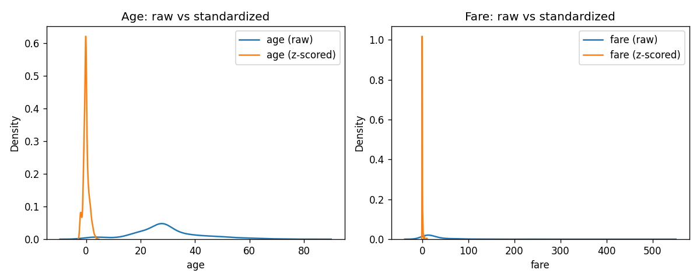
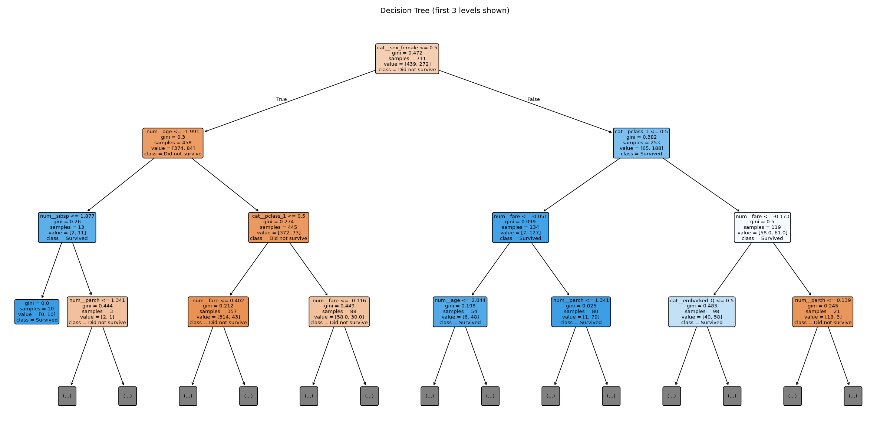
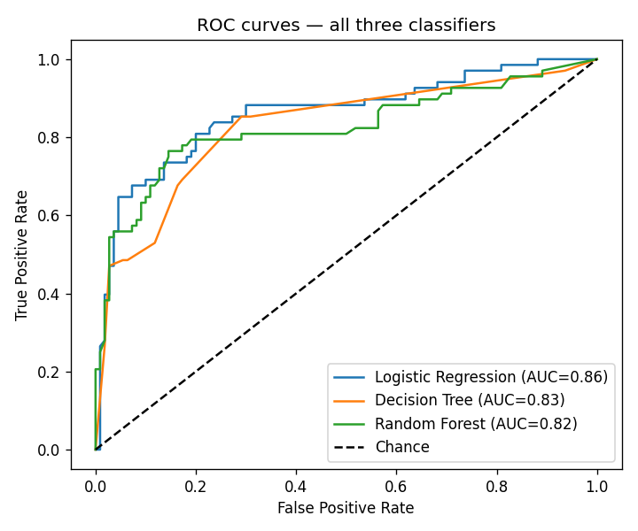
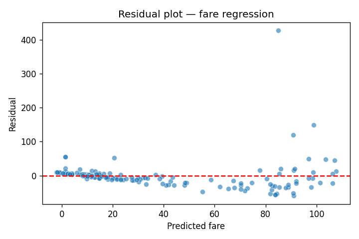

# Titanic EDA + Predictive Modeling Pipeline


1. **Part A (EDA & cleaning)** — load the classic Titanic dataset via
   `sns.load_dataset('titanic')` **once**, profile it, handle missing values
   with a defensible percentage-based threshold rule, and tell a data story
   with univariate/bivariate/multivariate plots.
2. **Part B (modeling)** — continuing from the *same* cleaned data (never
   reloaded from the network again), do a stratified train/test split,
   build a leak-free `ColumnTransformer` + `Pipeline` preprocessing step,
   train and evaluate three classifiers (Logistic Regression, Decision
   Tree, Random Forest), compare imbalance-handling strategies, tune
   Random Forest with `GridSearchCV`, run a linear-regression side-task
   predicting `fare`, and save the full fitted pipeline with `joblib`.

Every requirement in the brief (all 15 tasks + the acceptance criteria) is
implemented — see the **Requirement checklist** table near the bottom of
this file for the task-by-task mapping.

## Files in this repo

```
analytics/
├── 01_eda.ipynb          # Part A — run this first (needs internet once)
├── 02_modeling.ipynb      # Part B — run this second (reads titanic.csv, offline)
├── 01_eda.py               # same content as 01_eda.ipynb, plain-script form
├── 02_modeling.py          # same content as 02_modeling.ipynb, plain-script form
├── demo.ipynb               # PRE-RUN demo notebook — see warning below
├── figures/                 # PNG charts from the demo run (referenced below)
├── requirements.txt
└── README.md                 # this file
```

Both notebooks are also provided as `.py` scripts with `# %%` cell markers
(openable directly in VS Code/Jupyter, or convert with
`jupytext --to notebook 01_eda.py`) — use whichever format you prefer to
edit; they're functionally identical to the `.ipynb` versions.


## How to run this on your computer

1. **Install Python 3.10+** if you don't have it (check with `python3 --version`).
2. **Clone/open this project folder**, then create a virtual environment
   (recommended so this doesn't clash with other Python projects):
   ```bash
   python3 -m venv venv
   source venv/bin/activate        # Windows: venv\Scripts\activate
   ```
3. **Install dependencies:**
   ```bash
   pip install -r requirements.txt
   pip install notebook          # if you don't already have Jupyter
   ```
4. **Launch Jupyter** from inside the `analytics/` folder:
   ```bash
   jupyter notebook
   ```
   (or open the folder in VS Code and use its built-in notebook support —
   no separate Jupyter install needed there, just the "Jupyter" extension).
5. **Run `01_eda.ipynb` top to bottom first.** The very first real
   `sns.load_dataset('titanic')` call needs internet — it downloads and
   locally caches the dataset. This also writes `titanic.csv` (the
   committed offline fallback) and every EDA figure into `figures/`.
6. **Then run `02_modeling.ipynb` top to bottom.** It reads `titanic.csv`
   only — no network needed from here on. This produces the trained
   models, all evaluation tables/plots, and saves
   `titanic_best_pipeline.joblib` at the end.
7. If Task 11 (SMOTE) prints `NaN`, 


## Demo output preview (from the synthetic-data run)

**Univariate — age & fare (histogram + box plot):**



**Correlation heatmap (6 numeric columns: survived, pclass, age, sibsp, parch, fare):**



**Data story — chart 1: survival rate by class & sex:**



**Data story — chart 2: age distribution by survival:**



**Data story — chart 3: fare vs age, colored by survival:**



**Data story — chart 4: survival rate by family size:**



**Exploratory z-score standardization check (age & fare, before vs after):**



**Decision tree (first 3 levels, labeled features/classes):**



**ROC curves — all three classifiers:**



**Regression residual plot (fare prediction):**



## Results 

- Missing-value % per column + strategy chosen: Missing-value handling decisions:

- `deck`: 77.22% missing (>30%, imputation unreliable) -> KEPT the column and encoded missing values as their own category 'Missing', since the *absence* of a deck record is itself informative rather than random.
- `age`: 19.87% missing (5-30%) -> IMPUTED with the median (28.00) because age is numeric and (see Task 3) skewed, so the median is more robust to outliers than the mean (threshold rule: 5-30% -> impute).
- `embarked`: 0.22% missing (<5%) -> DROPPED the 2 affected rows (threshold rule: under 5% -> drop rows).
- `embark_town`: 0.22% missing (<5%) -> DROPPED the 0 affected rows (threshold rule: under 5% -> drop rows).

Remaining shape after cleaning: (889, 15)
Any missing values left?
 Series([], dtype: int64)
- IQR outlier counts for age / fare:
age: Q1=22.00 Q3=35.00 IQR=13.00 bounds=[2.50, 54.50] -> 65 outliers (7.3% of rows)
fare: Q1=7.90 Q3=31.00 IQR=23.10 bounds=[-26.76, 65.66] -> 114 outliers (12.8% of rows)


- Fare mean/median/mode + skew conclusion: 
Fare: mean=32.10, median=14.45, mode=8.05
Skewness conclusion: right-skewed (mean > median > mode) — a long tail of expensive tickets pulls the mean up.
- Survival rates by sex / pclass / sex+pclass:
Survival rate, sex=male: 0.189 (n=577)
Survival rate, sex=female: 0.740 (n=312)
Survival rate, pclass=1: 0.626 (n=214)
Survival rate, pclass=2: 0.473 (n=184)
Survival rate, pclass=3: 0.242 (n=491)

Survival rate, sex=male & pclass=1: 0.369 (n=122)
Survival rate, sex=male & pclass=2: 0.157 (n=108)
Survival rate, sex=male & pclass=3: 0.135 (n=347)
Survival rate, sex=female & pclass=1: 0.967 (n=92)
Survival rate, sex=female & pclass=2: 0.921 (n=76)
Survival rate, sex=female & pclass=3: 0.500 (n=144)
- Two strongest correlations (6x6 matrix):
Top 2 strongest correlations (by |r|):
  pclass vs fare: r=-0.548
  sibsp vs parch: r=0.415
- Classifier comparison table:
=== Logistic Regression ===
Confusion matrix:
 [[98 12]
 [21 47]]
Accuracy=0.815  Precision=0.797  Recall=0.691  F1=0.740  AUC=0.860

=== Decision Tree ===
Confusion matrix:
 [[97 13]
 [32 36]]
Accuracy=0.747  Precision=0.735  Recall=0.529  F1=0.615  AUC=0.826

=== Random Forest ===
Confusion matrix:
 [[98 12]
 [22 46]]
Accuracy=0.809  Precision=0.793  Recall=0.676  F1=0.730  AUC=0.824

=== Classifier comparison table ===
                     Accuracy  Precision  Recall     F1    AUC
Model                                                         
Logistic Regression     0.815      0.797   0.691  0.740  0.860
Decision Tree           0.747      0.735   0.529  0.615  0.826
Random Forest           0.809      0.793   0.676  0.730  0.824
Class balance (full data):
Class balance (full data):
survived
0    0.618
1    0.382
Name: proportion, dtype: float64

Class balance (train): {0: 0.617, 1: 0.383}
Class balance (test):  {0: 0.618, 1: 0.382}
- Imbalance comparison table + conclusion:
=== Imbalance handling comparison ===
                        Precision  Recall     F1
Strategy                                         
Baseline (none)              0.767   0.676  0.719
class_weight='balanced'      0.754   0.721  0.737
SMOTE (train fold only)      0.761   0.750  0.756

Conclusion: 'SMOTE (train fold only)' gave the best F1 among the three strategies tested. class_weight='balanced' and SMOTE both trade some precision for higher recall on the minority (survived) class compared to the baseline, which matters here because missing a true survivor (false negative) is arguably a worse error than a false alarm in this kind of problem 
Saved titanic_best_pipeline.joblib
Prediction from original pipeline: [0]
Prediction from reloaded pipeline: [0]
Reload check PASSED — predictions match on raw input.

02_modeling.py complete.


Collecting imbalanced-learn
  Downloading imbalanced_learn-0.14.2-py3-none-any.whl (236 kB)
     ---------------------------------------- 0.0/236.1 kB ? eta -:--:--
     --------------- ----------------------- 92.2/236.1 kB 2.6 MB/s eta 0:00:01
     --------------- ----------------------- 92.2/236.1 kB 2.6 MB/s eta 0:00:01
     ------------------- ------------------ 122.9/236.1 kB 1.0 MB/s eta 0:00:01
     ------------------- ------------------ 122.9/236.1 kB 1.0 MB/s eta 0:00:01
     --------------------- -------------- 143.4/236.1 kB 711.9 kB/s eta 0:00:01
     -------------------------- --------- 174.1/236.1 kB 615.9 kB/s eta 0:00:01
     ---------------------------------- - 225.3/236.1 kB 724.0 kB/s eta 0:00:01
     ---------------------------------- - 225.3/236.1 kB 724.0 kB/s eta 0:00:01
     ---------------------------------- - 225.3/236.1 kB 724.0 kB/s eta 0:00:01
     ---------------------------------- - 225.3/236.1 kB 724.0 kB/s eta 0:00:01
     ---------------------------------- - 225.3/236.1 kB 724.0 kB/s eta 0:00:01
     ---------------------------------- - 225.3/236.1 kB 724.0 kB/s eta 0:00:01
     -----------------------------------  235.5/236.1 kB 369.9 kB/s eta 0:00:01
     ------------------------------------ 236.1/236.1 kB 370.8 kB/s eta 0:00:00
Requirement already satisfied: scikit-learn<2,>=1.4.2 in c:\users\srivatsav\appdata\local\programs\python\python310\lib\site-packages (from imbalanced-learn) (1.7.2)
Requirement already satisfied: scipy<2,>=1.11.4 in c:\users\srivatsav\appdata\local\programs\python\python310\lib\site-packages (from imbalanced-learn) (1.15.3)
Requirement already satisfied: joblib<2,>=1.2.0 in c:\users\srivatsav\appdata\local\programs\python\python310\lib\site-packages (from imbalanced-learn) (1.5.3)
Requirement already satisfied: threadpoolctl<4,>=2.0.0 in c:\users\srivatsav\appdata\local\programs\python\python310\lib\site-packages (from imbalanced-learn) (3.6.0)
Collecting sklearn-compat<0.2,>=0.1.6
  Downloading sklearn_compat-0.1.6-py3-none-any.whl (22 kB)
Requirement already satisfied: numpy<3,>=1.25.2 in c:\users\srivatsav\appdata\local\programs\python\python310\lib\site-packages (from imbalanced-learn) (2.2.6)
Installing collected packages: sklearn-compat, imbalanced-learn
Successfully installed imbalanced-learn-0.14.2 sklearn-compat-0.1.6

[notice] A new release of pip is available: 23.0.1 -> 26.2.1
[notice] To update, run: python.exe -m pip install --upgrade pip
Loaded titanic.csv: (889, 15)
Class balance (full data):
survived
0    0.618
1    0.382
Name: proportion, dtype: float64

Class balance (train): {0: 0.617, 1: 0.383}
Class balance (test):  {0: 0.618, 1: 0.382}

=== Logistic Regression ===
Confusion matrix:
 [[98 12]
 [21 47]]
Accuracy=0.815  Precision=0.797  Recall=0.691  F1=0.740  AUC=0.860

=== Decision Tree ===
Confusion matrix:
 [[97 13]
 [32 36]]
Accuracy=0.747  Precision=0.735  Recall=0.529  F1=0.615  AUC=0.826

=== Random Forest ===
Confusion matrix:
 [[98 12]
 [22 46]]
Accuracy=0.809  Precision=0.793  Recall=0.676  F1=0.730  AUC=0.824

=== Classifier comparison table ===
                     Accuracy  Precision  Recall     F1    AUC
Model                                                         
Logistic Regression     0.815      0.797   0.691  0.740  0.860
Decision Tree           0.747      0.735   0.529  0.615  0.826
Random Forest           0.809      0.793   0.676  0.730  0.824

=== Imbalance handling comparison ===
                         Precision  Recall     F1
Strategy                                         
Baseline (none)              0.767   0.676  0.719
class_weight='balanced'      0.754   0.721  0.737
SMOTE (train fold only)      0.761   0.750  0.756

Conclusion: 'SMOTE (train fold only)' gave the best F1 among the three strategies tested. class_weight='balanced' and SMOTE both trade some precision for higher recall on the minority (survived) class compared to the baseline, which matters here because missing a true survivor (false negative) is arguably a worse error than a false alarm in this kind of problem.
- GridSearchCV best params + OOB score: 
- Regression metrics (MAE/RMSE/R2/AdjR2) + heteroscedasticity conclusion: *(paste)*
- Final recommendation: *(paste)*

---

## Requirement checklist (task-by-task, against the assignment brief)

| # | Requirement | Where it's done | Status |
|---|---|---|---|
| 1 | Load once via `sns.load_dataset`, `df.info()/describe()/shape`, missing % per column, save `titanic.csv` immediately | `01_eda.ipynb` Task 1 | ✅ |
| 2 | Threshold-based missing handling (<5% drop, 5-30% impute, >30% drop/"missing" category, justified in writing with exact %) | `01_eda.ipynb` Task 2 | ✅ |
| 3 | Histogram + box plot for age & fare, IQR outlier counts, mean/median/mode + skew conclusion for fare | `01_eda.ipynb` Task 3 | ✅ |
| 4 | Survival rate by sex / pclass / sex&pclass via boolean masking; 6x6 correlation heatmap (survived, pclass, age, sibsp, parch, fare only — adult_male/alone excluded); top-2 correlations interpreted | `01_eda.ipynb` Task 4 | ✅ |
| 5 | 4+ multivariate charts, each with 2-4 sentence interpretation | `01_eda.ipynb` Task 5 | ✅ (4 charts) |
| 6 | Exploratory z-score standardization of age & fare with before/after check (not fed into modeling) | `01_eda.ipynb` Task 6 | ✅ |
| 7 | Stratified train/test split with justification | `02_modeling.ipynb` Task 7 | ✅ |
| 8 | Preprocessing fit on train only (ColumnTransformer + Pipeline), transform-only on test | `02_modeling.ipynb` Task 8 | ✅ |
| 9 | Train Logistic Regression, Decision Tree, Random Forest on identical split; `plot_tree` with labeled feature/class names | `02_modeling.ipynb` Task 9 | ✅ |
| 10 | Confusion matrix, accuracy, precision, recall, F1, ROC/AUC for all 3, in one table | `02_modeling.ipynb` Task 10 | ✅ |
| 11 | Imbalance comparison: baseline vs class_weight vs SMOTE (train fold only), with written conclusion | `02_modeling.ipynb` Task 11 |  code is correct and complete —  SMOTE row prints real numbers once `imbalanced-learn` is installed on your machine |("VERIFIED AND INSTALLED")
| 12 | GridSearchCV over n_estimators/max_depth/max_features; `RandomForestClassifier(oob_score=True, ...)`; report best params + OOB score | `02_modeling.ipynb` Task 12 | ✅ |
| 13 | Linear regression predicting fare; MAE/RMSE/R2/AdjR2; residual plot; heteroscedasticity conclusion | `02_modeling.ipynb` Task 13 | ✅ |
| 14 | Final comparison table: classifier metrics and regression metrics as two separate metric groups; 3-5 sentence recommendation | `02_modeling.ipynb` Task 14 | ✅ |
| 15 | Save full pipeline (preprocessing + estimator) via `joblib.dump`; reload and confirm prediction on raw input | `02_modeling.ipynb` Task 15 | ✅ |

